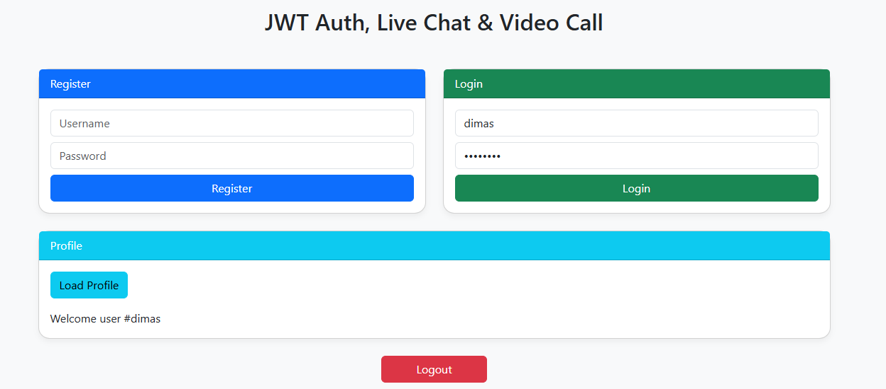
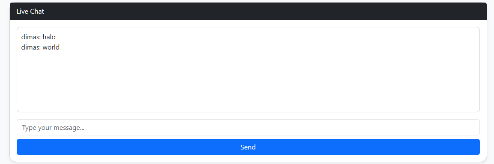
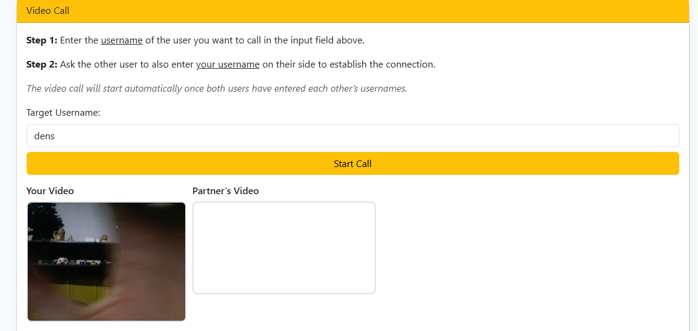

# Golang JWT Auth, Live Chat & Video Call

A real-time web application built with Golang that supports:

- ✅ Secure user authentication using JWT
- 💬 Live chat functionality via WebSocket
- 📹 Peer-to-peer video calling using WebRTC
- 🗂 Clean and modular code structure

---

## 🚀 Features

- User registration and login with JWT-based authentication
- Real-time messaging similar to YouTube Live Chat
- Browser-based video calls with peer-to-peer WebRTC connection
- Built using native Go packages (no frameworks)
- Lightweight HTML, Bootstrap frontend with vanilla JavaScript

---

## 📁 Project Structure

```

golang-jwt-livechat-videocall/
├── db/                    # PostgreSQL database connection
├── handlers/              # Logic for auth, WebSocket, profile, etc.
├── middleware/            # JWT verification middleware
├── models/                # User models and data types
├── views/                 # Frontend HTML pages (chat, login, call)
├── main.go                # Main entry point
├── go.mod / go.sum        # Go modules and dependencies
└── README.md              # This file

```

---

## 🔧 Requirements

- go 1.23.11
  require (
  github.com/golang-jwt/jwt/v5 v5.2.3 // indirect
  github.com/gorilla/websocket v1.5.3 // indirect
  github.com/lib/pq v1.10.9 // indirect
  golang.org/x/crypto v0.40.0 // indirect
  )
- PostgreSQL
- Modern browser (Chrome, Firefox, etc.)

---

## 🛠️ Running the App Locally

```bash
# Clone the repository
git clone https://github.com/matiusdimas/golang-jwt-livechat-videocall.git
cd golang-jwt-livechat-videocall

# Install Go modules
go mod tidy

# Run the server
go run main.go
```

---

## 🔐 JWT Authentication Flow

1. Users register or log in with their credentials
2. The server generates a JWT and sets it in an HTTP-only cookie
3. The client uses this token for protected routes, WebSocket, and video call access

---

## 💬 Live Chat Details

- Built using Go's `gorilla/websocket`
- Broadcast messages in real time to all connected users
- Efficient and lightweight for handling concurrent users

---

## 📹 Video Call Details

- Uses WebRTC for direct browser-to-browser video calls
- WebSocket handles signaling (offer/answer exchange)
- No external media server needed

---

## 📄 License

This project is licensed under the MIT License.

---

## 👤 Author

**Matius Dimas**
📧 [dimsmatius@gmail.com](mailto:dimsmatius@gmail.com)
🌐 [github.com/matiusdimas](https://github.com/matiusdimas)
